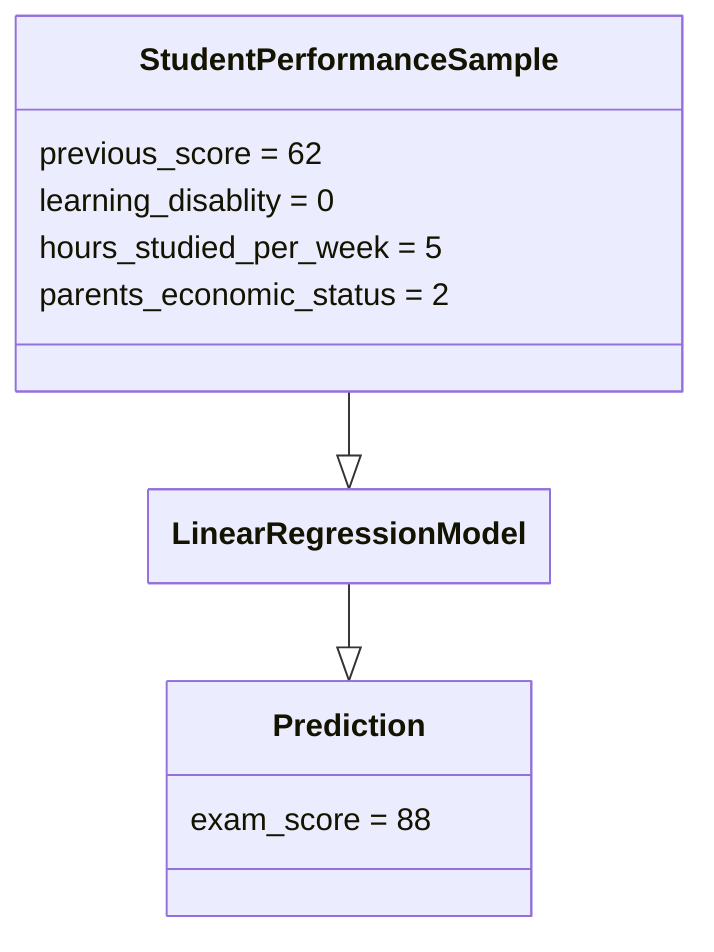

# Predictive Analytics

Beyond descriptive insights, you can also use data analytics tools in order to form predictive insights. As discussed earlier, predictive analytics involves forming predictions based on historical data. It can be applied across a wide array of domains. In the domain of business, you can predict future sales figures. In the domain of health care, you can predict patient outcomes. In the domain of education you can predict student performance.

In order to create predictive insights, you **train** a **model** on some historical data. A model in this context, refers to a mathematical equation or a statistical formula that takes in values from features as an input, and produces predictions as an output.

# Regression vs Classification

Depending on the target variable being predicted, predictive models can either be regression models or classification models. 

- **Regression Models** - these models predict a continuous quantitative variable. For example, let's say you are predicting the revenue of a business for next month. Since revenue is qualitative value that describes a the total profits for a given time period, then you need to use a regression model.
- **Classification Models** - these models predict some categorical or qualitative variable. For example, let's say you are predicting the patient outcomes of a given patient profile. Patient outcomes could be a qualitative variable that can be one of the following values: "admitted to ICU", "admitted to medical stations", and "deceased". For this scenario you will need a classification model.

# Creating Models

For models to be effective at predictions, it must be **trained** based on historical data. Training a model allows it to learn the underlying patterns and relationships between the features in your dataset. Here are the steps you will undergo in order to train the model properly.

#### 1 Model Preparation 

**Selecting Features and Target**. Before you begin training, you need to select which features will be included and excluded for training. In some cases you might also need to convert some features into quantitative values. This is because some models are only compatible with quantitative features. You will also need to set up the correct **target** column. This target column is what the model will be trained to predict. 

> *Curse of Dimensionality* - the curse of dimensionality is a term that describes how models have difficulties when learning from datasets the have a lot of dimensions. Dimension in this context refers to the amount of features. The more features there are, the harder it is for the models to learn the underlying relationships and patterns. When working with a lot of dimensions/features, model training will take a longer time, require more validation, and becomes more prone to issues.

**Model Selection**. After selecting your features, you the select the appropriate classification or regression model based on your dataset and target. You can find an assortment of these models in orange data mining. 

- *Linear Regression* - A simple regression model that tries to look for the best possible fit line that describes the relationship between your features and target.
- *Logistic Regression* - Similar to linear regression but this model is actually used for classification predictions
- *SVM* - Stands for support vector machines, this model can be used for classification or regression. Learns to predict using the similarity functions. This model is very appropriate for dataset that has their own similarity measurements between samples.
- *kNN* - A simple classification/regression model that predicts based on neighboring samples. Neighboring samples refer to samples that have similar values
- *Decision Tree* - A classification/regression model that predicts by constructing a decision tree. This model works well with qualitative features.
- *Random Forest* - An advanced version of the decision tree model. Instead of using one decision tree, predictions are made by creating a forest of decision trees that vote for the best prediction.
- *Stochastic Gradient Descent* - A classification/regression model that approximates the best possible line that describes the relationship between your features and target. Less precise but faster than linear regression. Suitable for large datasets
- *Naive Bayes* - Builds a statistical model based on the Bayesian statistical relationships of the features and target.
- *Neural Network* - An advanced model that predicts by constructing a neural network, a mathematical model based on brains. Takes a long time to train, but works well with highly dimensional data with complex relationships.

**Training, Testing, and Validation Split**. After setting up the dataset, you will need to split the dataset into dedicated portions. You will need to decide how to distribute the samples into the following portions.

- **Training Portion** -  these are the samples used during the actual model training.
- **Testing Portion** - these are the samples used to test the performance of the model.
- **Validation Portion** (optional) - in some mode advanced cases, you can dedicate some samples for validation, this portion is used to select the best hyperparameter values for training

The most basic way of splitting the dataset is to dedicate a small portion to testing and the rest to training. It is important that the model is trained on the training portion only. This is to ensure that during testing the models predicting performances is not assessed using the same samples that were used during training. You can think of the testing portion as the exam questions you are planning to give to the model. On the other hand, the training portion will be the study materials the model will learn from. The objective of the split is to ensure that the model does not cheat by knowing the exam questions while studying. 

You need to split the dataset in a such a way that the model is able to train as much as possible while leaving enough samples to properly test the dataset. In most cases, the more samples used for training, the better the model is. But you need to make sure that the testing portion is also big enough for the assessment to work properly. Here are some recommendations for splitting:

- 75% of samples for training, 25% of samples for testing
- 90% of samples for training, 10% of samples for testing
- 80% of samples for training, 10% for validation, 10% for testing

Once the dataset is fully prepared, some models will also require **hyperparameter** tuning. Hyperparameters are variables that you as a data analyst or data scientist will need to set. These hyperparameters will affect how the model is trained and therefore it will also affect how good the model is at predicting. 

> The task of hyperparameters tuning require some deep understanding of how the model training works. This is outside the scope of the class. But for the sake of experience we will try to play around with setting up with these hyperparameters

#### 2 Model Training

Model training is actually the easiest part of the process. Once everything is set up, model training will work automatically. Depending on the chosen model and the size of the dataset, model training can take a long time.

#### 3 Model Testing

Once the model is finished training, you can assess the models performance using the appropriate performance metric. In this step you will test the model on the samples reserved for testing. The model will predict the target variable and these predictions will be compared to the actual values of the target variable in the testing portion. Here are some performance metrics you can use:

##### Classification Model Performance

- *Accuracy* - (100% or 1.00 is a perfect score while 0% or 0.0 is zero is the lowest score), a simple metric calculated as the following.
  $$
  \text{accuracy} = \frac{\text{number of correct predictions}}{\text {number of incorrect predictions} + \text{number of correct predictions}}
  $$

- *Precision* - (100% or 1.00 is a perfect score while 0% or 0.0 is zero is the lowest score), a metric calculated based on **true positives** and **false positives**. For example, if your classification model has a target column/variable called `Delayed`, a positive classification will refer to "delayed", while a negative classification will refer to " not delayed". True positives refer to the number of samples in the testing portion the model predicted as positive and at the same time actually positive. On the other hand, true negative refers to the number of samples in the testing portion where the model predicted as positive but was actually negative. Precision is calcualted as:
  $$
  \text{precision} = \frac{\text{true positives}}{\text{true positives} + \text{false positives}}
  $$

- *Recall* - (100% or 1.00 is a perfect score while 0% or 0.0 is zero is the lowest score), a metric calculted based on true positives and **false negatives**, false negatives refer to the number of samples predicted as negative but was actually positive. The formula for this metric is:
  $$
  \text{recall} = \frac{\text{true positives}}{\text{true positives} + \text{false negatives}}
  $$

- *F1-score* an advanced performance metric that combine both precision and recall. It is calculated as:
  $$
  F_1 = 2 \times\frac{\text{precison} \times \text{recall}}{\text{precision} + \text{recall}}
  $$

Accuracy is an intuitive performance metric that can be easily explained to anyone, but it can have its drawbacks. Consider a testing portion where 10 samples have the target value: "delayed" while 90 samples have the target value: "not delayed". If you have a model that always predicts "not delayed". Then you end up with a model that has 90% accuracy. It sounds like a model that is good at predicting but its not actually predicting at all. It just guesses "not delayed" all the time. But since delays are rare, the model is also rarely wrong.

For this situation F1-score is a better measurement. It takes into account both precision and recall which gives a more complete overview of the models performance. If you assess the model that always guess "not delayed" using F1-score, it ends up with the following poor performance scores:
$$
\begin{aligned}
\text{precision} &= \frac{0}{0 + 0}\\
\text{recall} &= \frac{0}{0 + 10}\\
\end{aligned}
$$

> Since at least one of precision and recall is 0, then F1-score is also zero.

##### Regression Metrics

- *MSE* - (MSE = 0 is perfect prediction, the smaller the value the better), stands for Mean Square Error. This metric calculates the mean of the square error of all predictions. The square error is calculated as the square difference of the predicted value and the actual value.
  $$
  \text{MSE} = \frac{\sum {(\text{prediction} - \text{actual})^2}}{\text{number of predictions}}
  $$

- $R^2$ - ($R^2$ = 100% or 1 is a perfect predictor, the closer to zero the worse the predictor is). This metric is also called the coefficient of determination. This is a statistical measurement that refers the proportion of variance from the target that is explainable by the model. For example if your model has a performance of $R^2 = 54 \%$, it means that 54% of the variance is explainable/predictable by the model.

Once you complete the model testing step, you can choose to accept the model based on its performance, or you can go back to the previous steps to tweak the training or model choice in order to improve the model's performance. You can choose to include more features, increase the number of samples in the training portion, or can change hyperparameter values of the model or change the model itself.